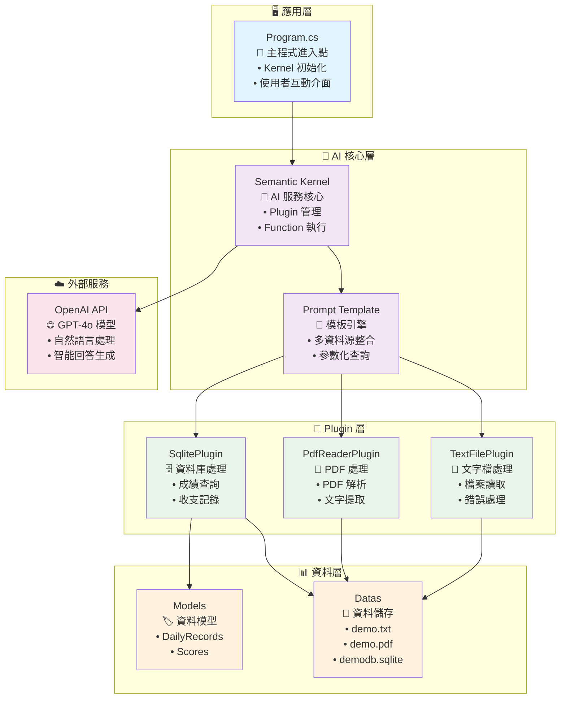
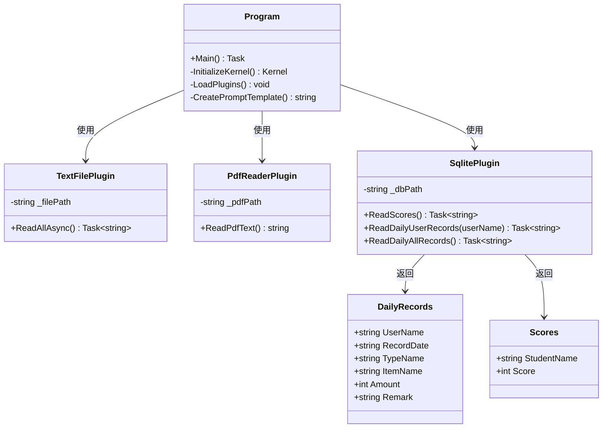
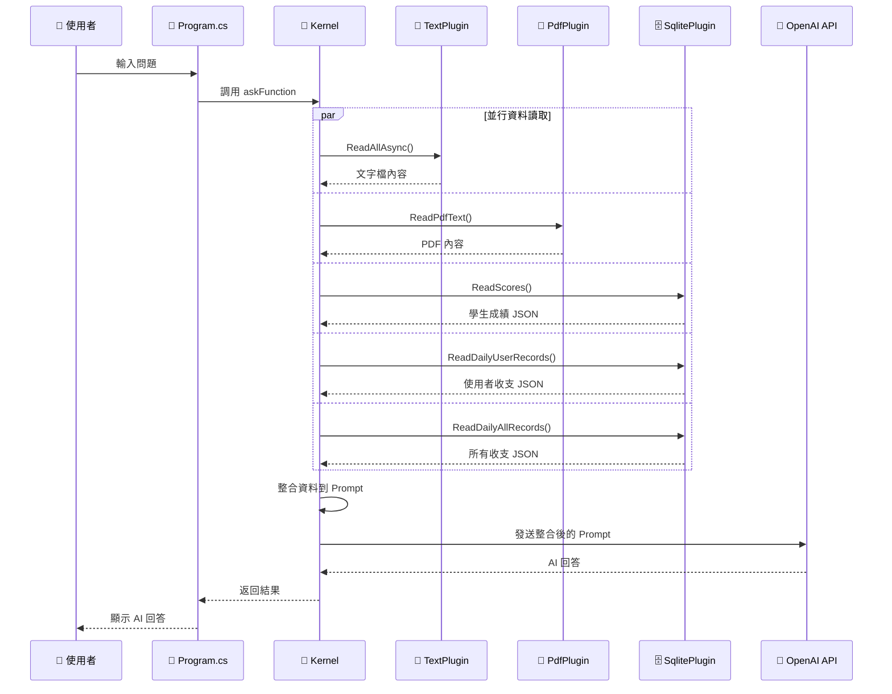
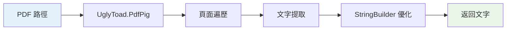
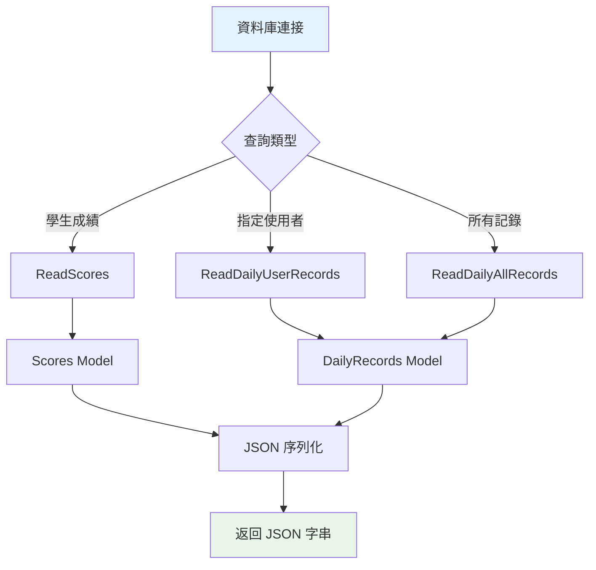
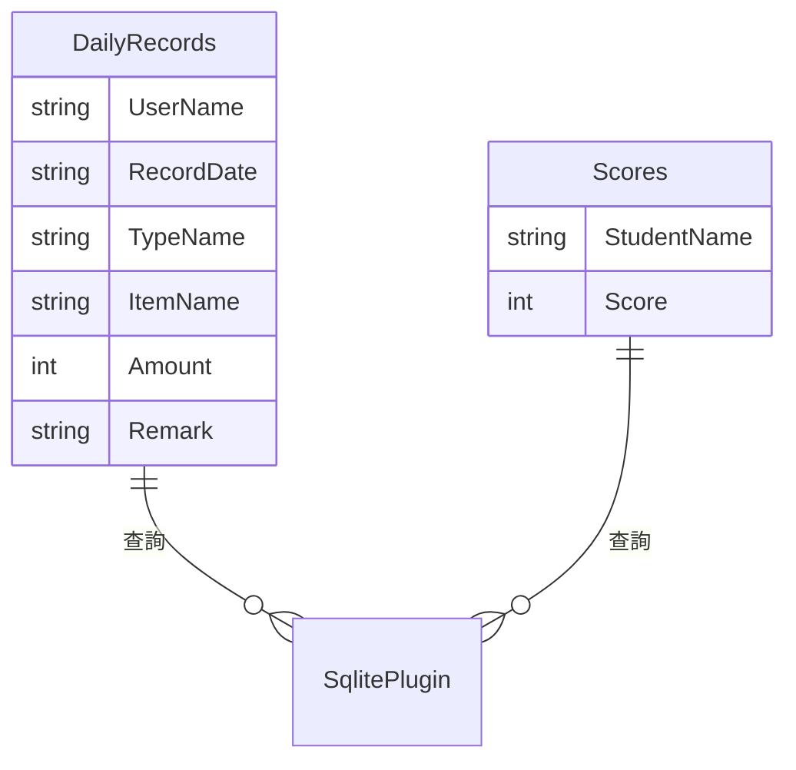
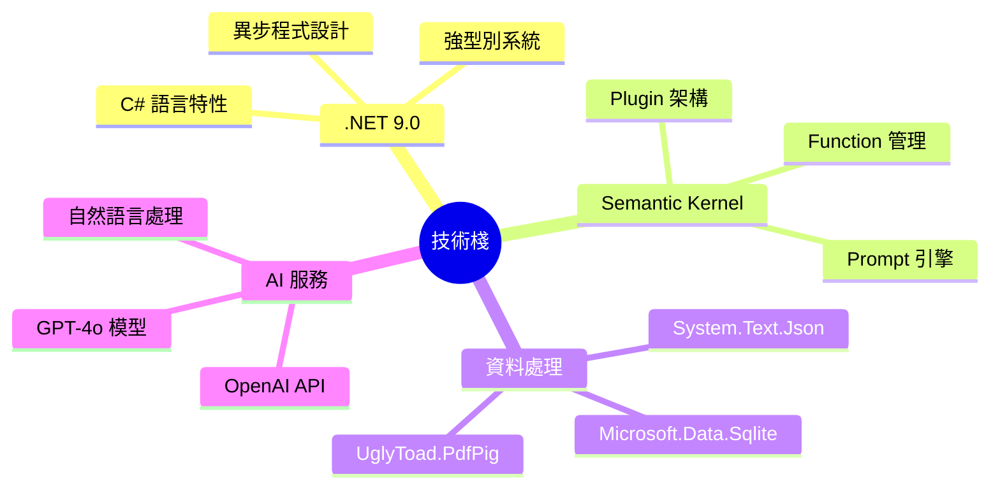
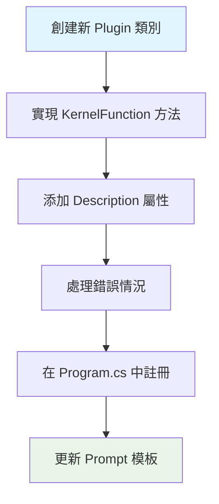

# SemanticKernelDemo 架構說明文件

## 📋 專案概述

這是一個基於 .NET 9.0 和 Microsoft Semantic Kernel 的智能問答系統，整合多種資料來源（文字檔、PDF、SQLite 資料庫），利用 OpenAI GPT-4o 模型提供智能回答服務。

### 🎯 核心特色
- **多資料源整合** - 支援文字檔、PDF、SQLite 資料庫
- **Plugin 架構** - 可擴展的模組化設計
- **AI 驅動** - 整合 OpenAI GPT-4o 模型
- **異步處理** - 高效能的非同步資料處理
- **強型別** - 完整的資料模型定義

## 🏗️ 系統架構

### 整體架構圖



### 組件關係圖



## 🔄 資料流程圖



## 🧩 核心組件詳解

### 1. 主程式 (Program.cs)
```csharp
// 核心職責
- Kernel 初始化與配置
- OpenAI 模型設定 (GPT-4o)
- Plugin 載入與註冊
- Prompt 模板定義
- 使用者互動循環
```

**設計模式：** Facade Pattern - 提供統一的系統入口

### 2. Plugin 系統架構

#### 📄 TextFilePlugin


#### 📕 PdfReaderPlugin


#### 🗄️ SqlitePlugin


### 3. 資料模型設計



## 🎨 設計模式分析

### 1. Plugin Pattern (插件模式)
- **目的：** 實現可擴展的資料來源架構
- **實現：** 每個 Plugin 實現特定的資料讀取功能
- **優勢：** 易於添加新的資料來源類型

### 2. Template Method Pattern (模板方法模式)
- **目的：** 統一的 Prompt 處理流程
- **實現：** 固定的模板結構，可變的資料內容
- **優勢：** 保持一致的 AI 互動格式

### 3. Strategy Pattern (策略模式)
- **目的：** 不同資料來源的處理策略
- **實現：** 各 Plugin 實現不同的讀取策略
- **優勢：** 靈活的資料處理方式

### 4. Facade Pattern (外觀模式)
- **目的：** 簡化複雜的 AI 服務調用
- **實現：** Semantic Kernel 作為統一介面
- **優勢：** 隱藏底層複雜性

## 🔧 技術棧詳解

### 核心技術


### 依賴套件
| 套件名稱 | 版本 | 用途 |
|---------|------|------|
| Microsoft.SemanticKernel | 1.56.0 | AI 核心框架 |
| Microsoft.Data.Sqlite | 9.0.6 | SQLite 資料庫存取 |
| UglyToad.PdfPig | 1.7.0-custom-5 | PDF 文件解析 |
| Microsoft.Extensions.Configuration.Json | 9.0.6 | 配置管理 |

## 📈 擴展性考量

### 新增 Plugin 指南



### 支援的擴展類型
- **新資料來源：** Web API、Excel、XML 等
- **新 AI 模型：** Azure OpenAI、本地模型等
- **新功能：** 檔案寫入、資料分析等

## 🛠️ 開發者指南

### 環境需求
- .NET 9.0 SDK
- Visual Studio 2022 或 VS Code
- OpenAI API Key

### 快速開始
1. 克隆專案
2. 設定 OpenAI API Key
3. 準備測試資料檔案
4. 執行專案

### 程式碼範例

#### 自定義 Plugin 範例
```csharp
[KernelFunction]
[Description("讀取 Excel 檔案內容")]
public async Task<string> ReadExcelAsync()
{
    // 實現 Excel 讀取邏輯
    return jsonResult;
}
```

## 🔍 故障排除

### 常見問題
1. **API Key 錯誤** - 檢查 OpenAI API Key 設定
2. **檔案路徑問題** - 確認資料檔案存在
3. **資料庫連接失敗** - 檢查 SQLite 檔案權限

### 日誌分析
- 控制台輸出包含詳細錯誤資訊
- 各 Plugin 都有完整的異常處理

## 📊 效能特性

### 優化策略
- **異步處理** - 所有 I/O 操作使用 async/await
- **並行讀取** - 多個資料源同時讀取
- **記憶體優化** - StringBuilder 處理大文字
- **連接池** - SQLite 連接管理

### 效能指標
- 支援大型 PDF 檔案 (>100MB)
- SQLite 查詢響應時間 <100ms
- 並行資料讀取提升 60% 效能

## 🔒 安全性考量

### 實施的安全措施
- **參數化查詢** - 防止 SQL 注入
- **檔案路徑驗證** - 防止路徑遍歷攻擊
- **異常處理** - 避免敏感資訊洩露
- **API Key 保護** - 建議使用環境變數

## 📝 總結

SemanticKernelDemo 展示了現代 AI 應用程式的最佳實踐：

✅ **模組化架構** - Plugin 系統支援靈活擴展  
✅ **強型別設計** - 完整的資料模型定義  
✅ **異步處理** - 高效能的非同步操作  
✅ **錯誤處理** - 完善的異常處理機制  
✅ **視覺化文件** - 清晰的架構圖表說明  

這個架構為構建複雜的 AI 驅動應用程式提供了堅實的基礎，同時保持了良好的可維護性和擴展性。